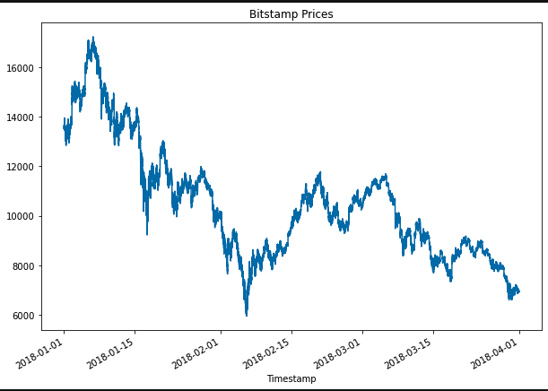
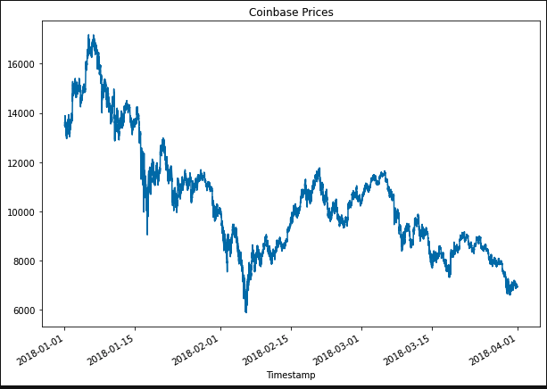
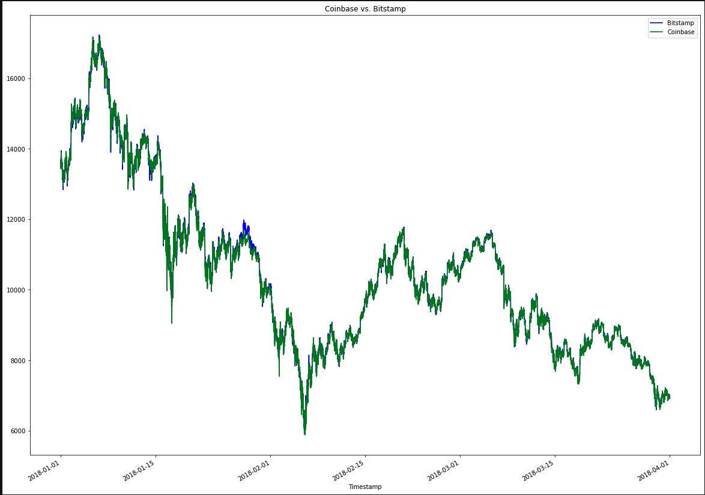
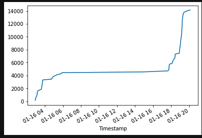

# Challenge 3 - Crypto Arbitrage - Coinbase & Bitstamp

## Application Details

This application was created through Python and sorts through historical BTC data on exchanges Bitstamp and Coinbase.  Within my app I work through the three phases of financial analysis (data collection, preparation, and analysis).  The goal of the project was to look back and see if there were any arbitrage opportunities within the year 2018.

## Examples

## Contributors
Matthew P Rudd - mprudd2@gmail.com

## License 
MIT